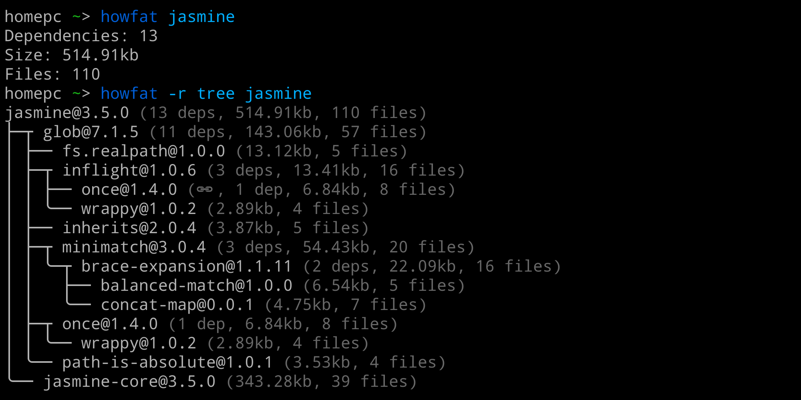

# howfat
[](https://github.com/megahertz/howfat/actions/workflows/tests.yml)
[](https://badge.fury.io/js/howfat)

Shows how fat is a package together with its dependencies



## Usage

### Simple

`npx howfat mkdirp`

Specified version or version range:

`npx howfat mkdirp@^0.5.0`

Local packages

```bash
cd my-project
npx howfat
```

`npx howfat ../my-other-package`

Git or github

`npx howfat https://github.com/substack/node-mkdirp`

`npx howfat ssh://git@github.com:substack/node-mkdirp.git#0.3.4`

### Different reporters

Show all dependencies as a tree:

```
$ npx howfat -r tree mkdirp
mkdirp@0.5.1 (1 dep, 41.49kb, 37 files)
╰── minimist@0.0.8 (20.78kb, 14 files)
```

as a table:

```
$ npx howfat -r table mkdirp
mkdirp@0.5.1 (1 dep, 41.49kb, 37 files)
╭────────────────┬──────────────┬─────────┬───────╮
│ Name           │ Dependencies │    Size │ Files │
├────────────────┼──────────────┼─────────┼───────┤
│ minimist@0.0.8 │            0 │ 20.78kb │    14 │
╰────────────────┴──────────────┴─────────┴───────╯
```

### Other options

```
  -d, --dev-dependencies BOOLEAN   Fetch dev dependencies, default false
  -p, --peer-dependencies BOOLEAN  Fetch peer dependencies, default false
  
  -r, --reporter STRING            'default', 'table', 'tree'
      --fields STRING              Displayed fields separated by a comma:
                                   dependencies,size,files,license,
                                   author,description,maintainers,time
      --sort STRING                Sort field. Add minus sign for 
                                   desc order, like size-. Default to 'name'
  -v, --verbose BOOLEAN            Show additional logs
      --no-colors BOOLEAN          Prevent color output
      --no-human-readable BOOLEAN  Show size in bytes
      
  --registry-url STRING            Default to https://registry.npmjs.org/
                            
  --http                           Node.js RequestOptions, like:
  --http.timeout NUMBER            Request timeout in ms, default 10000
  --http.connection-limit NUMBER   Max simultaneous connections, default 10
  --http.retry-count NUMBER        Try to fetch again of failure, default 5
  --http.proxy STRING              A proxy server url
  
  --show-config                    Show the current configuration
  --version                        Show howfat version
  --help                           Show this help
```

## Accuracy

Different package managers use different dependency resolution algorithms. Even
different versions of the same manager will resolve different dependency tree.
So, this package tries to calculate stats similar to `npm`, but keep in mind that
it provides approximate results.

## Why should I care about my package size?

- Small package is installed much faster on CI
- Runs faster via `npx`
- Less dependencies = less troubles
